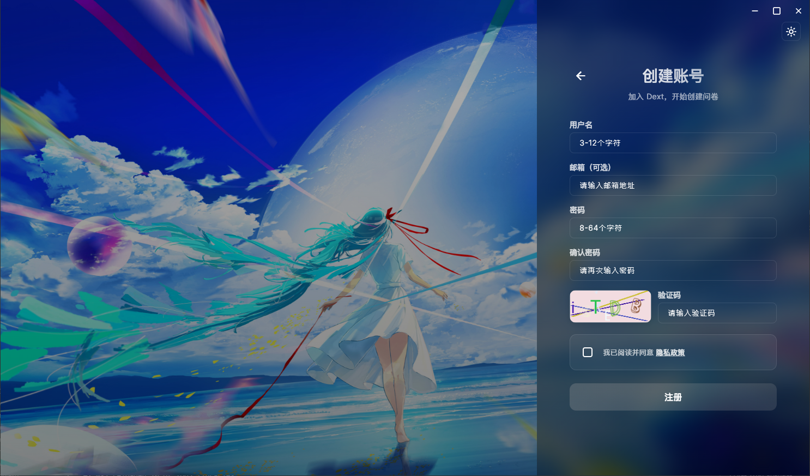
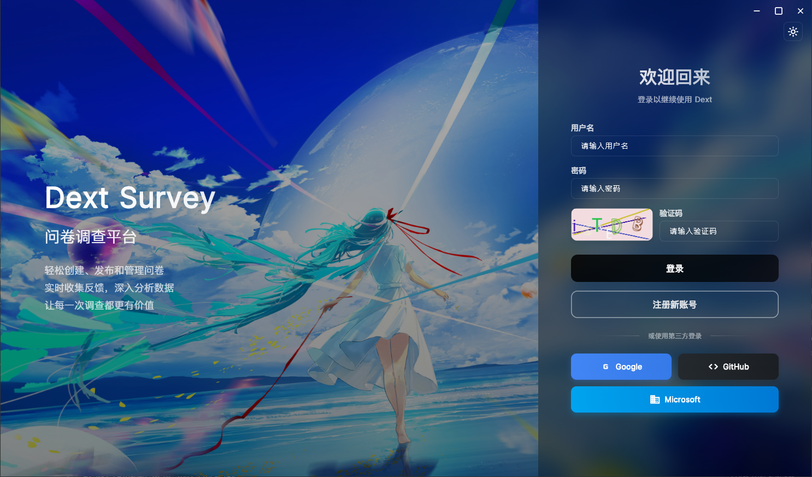
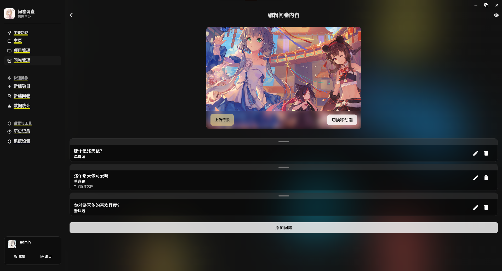
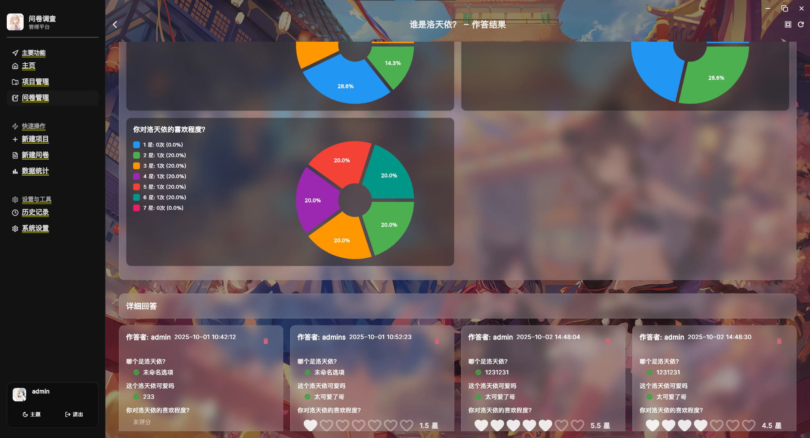
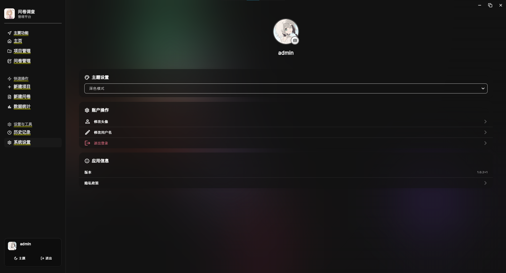
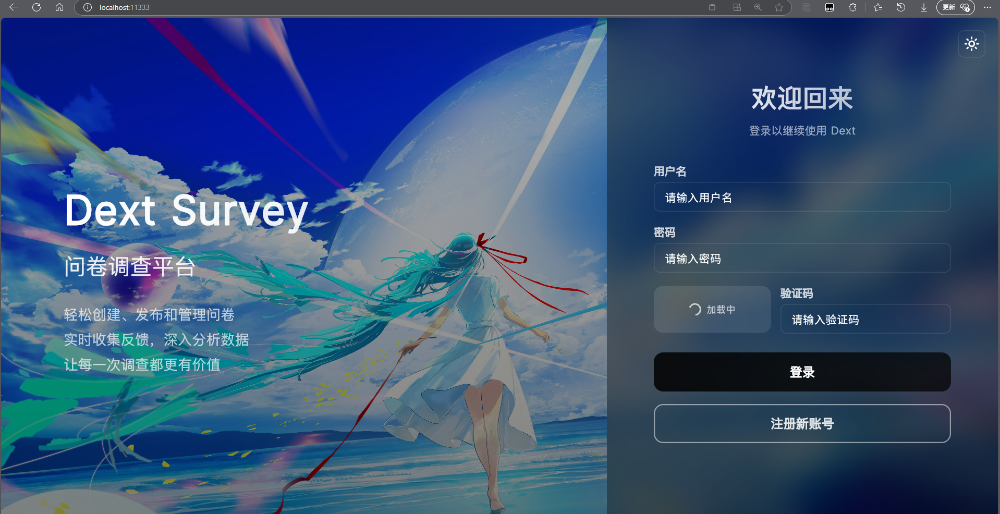

# Dext - 花里胡哨的问卷调查

<p align="center">
    
</p>

<p align="center">
    <a href='https://github.com/chuishui233/dext'></a>
    <a href='https://github.com/chuishui233/dext'></a>
    <a href='https://github.com/chuishui233/dext/releases'></a>
    <a href='https://flutter.dev'></a>
</p>

## 项目介绍

**Dext** 是一款功能强大的开源问卷调查应用，采用 Flutter 跨平台技术开发。应用提供了完整的问卷创建、发布、填写、数据分析等功能，支持多种题型和丰富的交互体验。

### 核心功能

- 📝 **问卷创建** - 支持多种题型（单选、多选、填空、评分等）
- 🔗 **公开访问** - 支持通过链接分享问卷，无需注册即可填写
- 📊 **数据分析** - 实时统计分析，可视化展示结果
- 🔒 **端到端加密** - RSA + AES-GCM
- 📋 **智能剪切板** - 自动检测剪切板中的问卷链接并提示访问

### 特色亮点

- **智能问卷设计** - 拖拽式问卷编辑器，所见即所得
- **多媒体支持** - 支持图片、音频、视频等多媒体内容
- **实时预览** - 创建过程中实时预览问卷效果
- **数据可视化** - 图表展示问卷统计结果
- **响应式设计** - 完美适配各种屏幕尺寸

## 项目地址

<a href='https://github.com/chuishui233/dext'></a>

## 支持平台

| 平台                           | 支持状态
|------------------------------- | ---------------------------
| Android                        |  ✅
| iOS                            |  ✅
| Windows                        |  ✅
| Web                            |  ✅
| macOS                          |  ✅
| Linux                          |  ✅

## 项目结构

```
lib/
├── main.dart                    -- 应用入口
├── components/                  -- 通用组件
│   ├── glass_card.dart         -- 玻璃拟态卡片
│   ├── media_gallery.dart      -- 媒体画廊
│   └── multi_select_actions.dart -- 多选操作
├── controllers/                 -- 控制器
│   └── survey_runtime.dart     -- 问卷运行时控制
├── models/                      -- 数据模型
│   ├── captcha.dart            -- 验证码模型
│   ├── home_state.dart         -- 首页状态
│   ├── project.dart            -- 项目模型
│   ├── survey.dart             -- 问卷模型
│   └── user.dart               -- 用户模型
├── pages/                       -- 页面
│   ├── create_survey_page.dart -- 创建问卷页面
│   ├── edit_question_page.dart -- 编辑题目页面
│   ├── survey_preview_page.dart -- 问卷预览页面
│   ├── survey_results_page.dart -- 问卷结果页面
│   ├── public_access_page.dart -- 公开访问页面
│   └── submission_detail_page.dart -- 提交详情页面
├── services/                    -- 服务层
│   ├── api_service.dart        -- API服务
│   ├── auth_service.dart       -- 认证服务
│   ├── crypto_service.dart     -- 加密服务
│   ├── clipboard_service.dart  -- 剪切板服务
│   └── url_handler.dart        -- URL处理服务
├── utils/                       -- 工具类
│   ├── constants.dart          -- 常量定义
│   ├── helpers.dart            -- 辅助函数
│   └── validators.dart         -- 验证器
└── widgets/                     -- 自定义组件
    ├── question_display_widget.dart -- 题目显示组件
    └── survey_form_widget.dart -- 问卷表单组件
```

## 技术栈

### 开发环境
|                                | 版本
|------------------------------- | ---------------------------
| Flutter SDK                    |  3.32.0+
| Dart SDK                       |  3.8.0+

### 核心依赖
|                                | 版本          | 用途
|------------------------------- | ------------- | ---------------------------
| forui                          |  ^0.12.0      | UI组件库
| http                           |  ^1.1.0       | 网络请求
| flutter_secure_storage         |  ^9.2.4       | 安全存储
| shared_preferences             |  ^2.5.3       | 本地存储
| provider                       |  ^6.1.5+1     | 状态管理
| cached_network_image           |  ^3.4.1       | 图片缓存
| file_picker                    |  ^10.1.9      | 文件选择
| image_picker                   |  ^1.0.4       | 图片选择
| video_player                   |  ^2.10.0      | 视频播放
| pull_to_refresh                |  ^2.0.0       | 下拉刷新
| flutter_staggered_grid_view    |  ^0.7.0       | 瀑布流布局
| uni_links                      |  ^0.5.1       | 深度链接
| url_launcher                   |  ^6.2.5       | URL启动
| window_manager                 |  ^0.3.8       | 窗口管理
| tray_manager                   |  ^0.2.3       | 系统托盘
| web                            |  ^1.1.0       | Web平台支持
| clipboard                      |  ^0.1.3       | 剪切板操作

### 安全组件
|                                | 版本          | 用途
|------------------------------- | ------------- | ---------------------------
| pointycastle                   |  ^4.0.0       | 加密算法库
| fast_rsa                       |  ^3.8.5       | RSA加密
| crypto                         |  ^3.0.6       | 加密算法
| basic_utils                    |  ^5.8.2       | 基础工具

## 快速开始

### 环境要求

- Flutter SDK 3.32.0 或更高版本
- Dart SDK 3.8.0 或更高版本
- Android Studio / VS Code
- Git

### 安装步骤

1. **克隆项目**
```bash
git clone https://github.com/chuishui233/dext.git
cd dext
```

2. **安装依赖**
```bash
flutter pub get
```

3. **生成图标**
```bash
flutter pub run flutter_launcher_icons:main
```

4. **运行应用**
```bash
# 调试模式
flutter run

# 发布模式
flutter run --release
```

### 构建发布版本

```bash
# Android APK
flutter build apk --release

# Android App Bundle
flutter build appbundle --release

# iOS
flutter build ios --release

# Windows
flutter build windows --release

# macOS
flutter build macos --release

# Linux
flutter build linux --release

# Web
flutter build web --release
```

## 功能特性

### 🎯 问卷管理
- 创建、编辑、删除问卷
- 支持多种题型：单选、多选、填空、评分、排序等
- 问卷模板和主题自定义
- 问卷发布和分享

### 📊 数据分析
- 实时数据统计
- 可视化图表展示
- 数据导出功能
- 详细的提交记录

### 🔐 安全特性
- **端到端加密** - RSA + AES-GCM

### 🌐 网络功能
- **统一链接访问** - 支持 `wucode.xyz/?id=问卷ID` 格式统一跳转
- **智能剪切板监听** - 自动检测剪切板中的问卷链接并提示访问
- **深度链接集成** - 支持 Universal Links 和 App Links
- **公开问卷访问** - 无需注册即可通过链接填写问卷
- **跨平台兼容** - Web、Android、iOS 三平台统一访问体验
- **离线数据缓存** - 支持离线填写和自动同步

## 配置说明

### 服务器配置

应用需要配合后端服务器使用，服务器项目位于 `i:\Dext-Server`。

### 深度链接配置

应用支持通过 `https://wucode.xyz/?id=问卷ID` 格式的链接直接访问问卷。

## 项目截图

### 移动端/桌面端界面

<p align="center">
  
  
  
  
</p>

<p align="center">
  
</p>

### Web端界面

<p align="center">
  
</p>

> 📱 **跨平台一致性**：在不同平台上保持一致的用户体验和功能完整性

## 贡献指南

欢迎提交 Issue 和 Pull Request 来帮助改进项目。

1. Fork 本项目
2. 创建特性分支 (`git checkout -b feature/AmazingFeature`)
3. 提交更改 (`git commit -m 'Add some AmazingFeature'`)
4. 推送到分支 (`git push origin feature/AmazingFeature`)
5. 开启 Pull Request

## 开源协议

本项目采用 MIT 协议 - 查看 [LICENSE](LICENSE) 文件了解详情。

## 免责声明

1. 本项目提供的源代码仅供学习和研究使用，请勿用于商业盈利。

2. 用户使用本系统从事任何违法违规的事情，一切后果由用户自行承担，作者不承担任何法律责任。

3. 如有侵犯权利，请联系作者删除。

4. 下载或使用本项目源码则代表您同意上述免责声明协议。

## 联系方式

- 项目地址：[https://github.com/chuishui233/dext](https://github.com/chuishui233/dext)
- 问题反馈：[Issues](https://github.com/chuishui233/dext/issues)

---

⭐ 如果这个项目对您有帮助或者很有意思，请给它一个星标，非常感谢！
