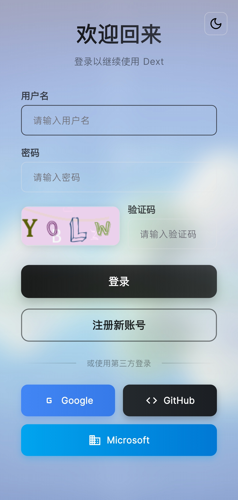
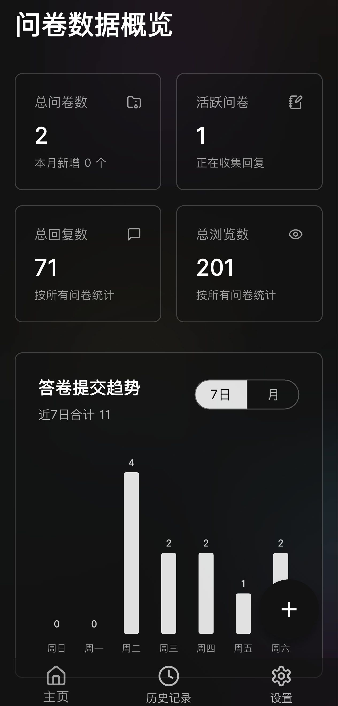
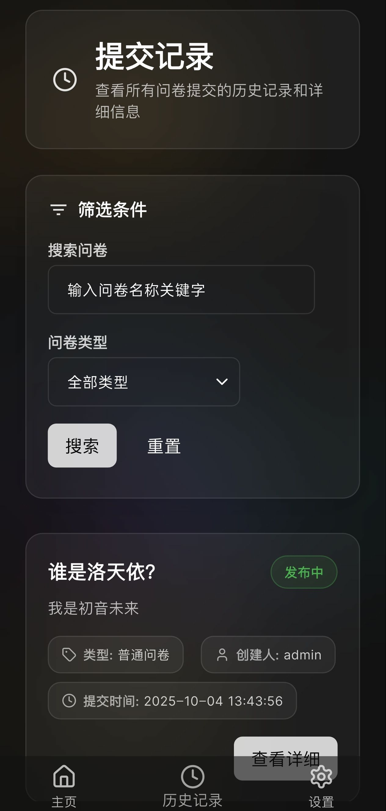
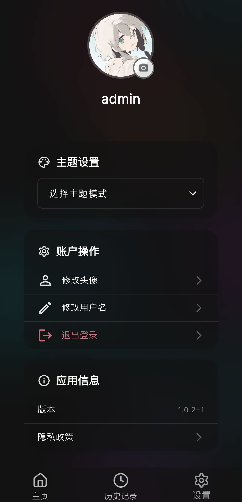
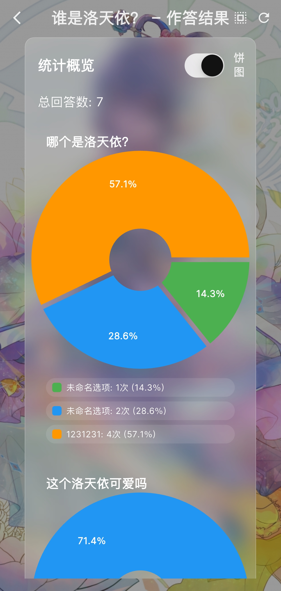

# Dext - 花里胡哨的问卷调查

<p align="center">
  
</p>

<p align="center">
  <a href='https://github.com/chuishui233/dext'></a>
  <a href='https://github.com/chuishui233/dext'></a>
  <a href='https://github.com/chuishui233/dext/releases'></a>
  <a href='https://flutter.dev'></a>
</p>

## 项目简介

**Dext** 是一款基于 Flutter 的跨平台开源问卷 / 调研工具，主打 **「花里胡哨但好用」** 的编辑和填写体验。  
它提供从「问卷设计 → 发布分享 → 填写收集 → 结果分析导出」的一整套流程，适合个人、小团队甚至中小企业自建问卷系统使用。

### 功能一览

- **问卷编辑器**
  - 支持单选、多选、填空、评分、排序等常见题型
  - 支持题目分组、必答设置、校验规则等
  - 实时预览、所见即所得
- **分享与访问**
  - 生成公开访问链接，一键分享
  - 支持多端访问
- **结果统计与分析**
  - 填写数据实时统计
  - 支持图表展示
  - 支持导出为 Excel 等格式

## 仓库地址

<a href='https://github.com/chuishui233/dext'></a>

## 项目截图

### 桌面端界面

<p align="center">
  
  
  
  
  
</p>

### 移动端界面

<p align="center">
  
  
  
</p>

<p align="center">
  
  
  
</p>

### Web端界面

<p align="center">
  
</p>

## 支持平台

| 平台                           | 支持状态
|------------------------------- | ---------------------------
| Android                        |  ✅
| iOS                            |  ✅
| Windows                        |  ✅
| Web                            |  ✅
| macOS                          |  ？
| Linux                          |  ？

>？ 为未测试编译运行

## 技术栈

### 开发环境
|                                | 版本
|------------------------------- | ---------------------------
| Flutter SDK                    |  3.35.0+
| Dart SDK                       |  3.9+
| 依赖 | 版本 | 用途 |
|------|------|------|
| flutter | sdk | Flutter 框架 |
| provider | ^6.1.5+1 | 状态管理 |
| forui | ^0.16.0 | UI 组件库 |
| layout | ^1.0.5 | 响应式布局 |
| flutter_localizations | sdk | 国际化支持 |

---

## 网络与 API

| 依赖 | 版本 | 用途 |
|------|------|------|
| http | ^1.1.0 | 基础 HTTP 请求 |
| dio | ^5.9.0 | HTTP PLUS |
| http_parser | ^4.1.2 | HTTP 解析 |
| oauth2_client | ^4.2.0 | OAuth2 登录 |

---

## 本地存储

| 依赖 | 版本 | 用途 |
|------|------|------|
| shared_preferences | ^2.5.3 | 轻量 KV 存储 |
| flutter_secure_storage | ^10.0.0-beta.4 | 安全存储 |
| path_provider | ^2.1.1 | 文件路径 |

---

## 文件与媒体

| 依赖 | 版本 | 用途 |
|------|------|------|
| file_picker | ^10.1.9 | 文件选择 |
| image_picker | ^1.0.4 | 图片选择 |
| desktop_drop | ^0.6.1 | 拖拽文件 |
| image | ^4.2.0 | 图片处理 |
| crop_image_plus | git | 图片裁剪 |

---

## 多媒体

| 依赖 | 版本 | 用途 |
|------|------|------|
| video_player | ^2.10.0 | 视频播放 |
| video_player_win | ^3.2.0 | Windows 视频支持 |
| radio_player | ^2.1.0 | 音频播放 |
| photo_view | ^0.15.0 | 图片预览 |

---

## UI / 动效

| 依赖 | 版本 | 用途 |
|------|------|------|
| cached_network_image | ^3.4.1 | 图片缓存 |
| shimmer | ^3.0.0 | 加载动画 |
| flutter_speed_dial | ^7.0.0 | 悬浮按钮 |
| pull_to_refresh | ^2.0.0 | 下拉刷新 |
| flutter_staggered_grid_view | ^0.7.0 | 瀑布流 |
| fl_chart | 0.71.0 | 图表 |
| flutter_svg | ^2.0.9 | SVG |
| cupertino_icons | ^1.0.2 | iOS 图标 |

---

## 桌面能力

| 依赖 | 版本 | 用途 |
|------|------|------|
| window_manager | ^0.5.1 | 窗口管理 |
| tray_manager | ^0.5.2 | 系统托盘 |
| windows_single_instance | ^1.0.1 | 单实例 |

---

## 系统交互

| 依赖 | 版本 | 用途 |
|------|------|------|
| url_launcher | ^6.2.5 | 打开链接 |
| app_links | ^6.4.1 | Deep Link |
| clipboard_watcher | ^0.2.0 | 剪贴板监听 |
| connectivity_plus | ^7.0.0 | 网络状态 |
| package_info_plus | ^8.0.0 | 应用信息 |

---

## 加密

| 依赖 | 版本 | 用途 |
|------|------|------|
| cryptography | ^2.5.0 | 现代加密 |
| crypto | ^3.0.6 | hash |
| pointycastle | ^4.0.0 | 算法库 |
| basic_utils | ^5.8.2 | 工具函数 |

---

## 数据处理

| 依赖 | 版本 | 用途 |
|------|------|------|
| syncfusion_flutter_xlsio | ^31.1.19 | Excel 导出 |

---

## 第三方

| 依赖 | 版本 | 用途 |
|------|------|------|
| getuiflut | git | 个推推送 SDK |

## 快速开始

### 环境要求

- Flutter SDK 3.35.0 或更高版本（最低支持版本）
- Dart SDK 3.9 或更高版本（最低支持版本）
- Android Studio / VS Code
- Git

### 安装步骤

1. **克隆项目**
```bash
git clone https://github.com/chuishui233/dext.git
cd dext
```

2. **安装依赖**
```bash
flutter pub get
```

3. **生成图标**
```bash
flutter pub run flutter_launcher_icons:main
```

4. **运行应用**
```bash
# 调试模式
flutter run

# 发布模式
flutter run --release
```

### 构建发布版本

```bash
# Android APK
flutter build apk --release

# Android App Bundle
flutter build appbundle --release

# iOS
flutter build ios --release

# Windows
flutter build windows --release

# macOS
flutter build macos --release

# Linux
flutter build linux --release

# Web
flutter build web --release
```

## 功能特性

### 问卷管理
- 创建、编辑、删除问卷
- 支持多种题型：单选、多选、填空、评分、排序等
- 问卷模板和主题自定义
- 问卷发布和分享

### 数据分析
- 实时数据统计
- 可视化图表展示
- 数据导出功能
- 详细的提交记录

## 贡献指南

欢迎提交 Issue 和 Pull Request 来帮助改进项目。

1. Fork 本项目
2. 创建特性分支 (`git checkout -b feature/AmazingFeature`)
3. 提交更改 (`git commit -m 'Add some AmazingFeature'`)
4. 推送到分支 (`git push origin feature/AmazingFeature`)
5. 开启 Pull Request

## 开源协议

本项目采用 MPL2.0 协议 - 查看 [LICENSE](LICENSE.txt) 文件了解详情。

## 免责声明

1. 本项目提供的源代码仅供学习和研究使用，请勿用于商业盈利。

2. 用户使用本系统从事任何违法违规的事情，一切后果由用户自行承担，作者不承担任何法律责任。

3. 如有侵犯权利，请联系作者删除。

4. 下载或使用本项目源码则代表您同意上述免责声明协议。

## 联系方式

- 开发交流群：1056789610

- 项目地址：[https://github.com/chuishui233/dext](https://github.com/chuishui233/dext)
- 问题反馈：[Issues](https://github.com/chuishui233/dext/issues)

---

⭐ 如果这个项目对您有帮助或者很有意思，请给它一个星标，非常感谢！
